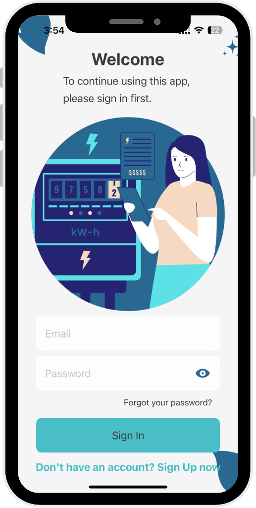
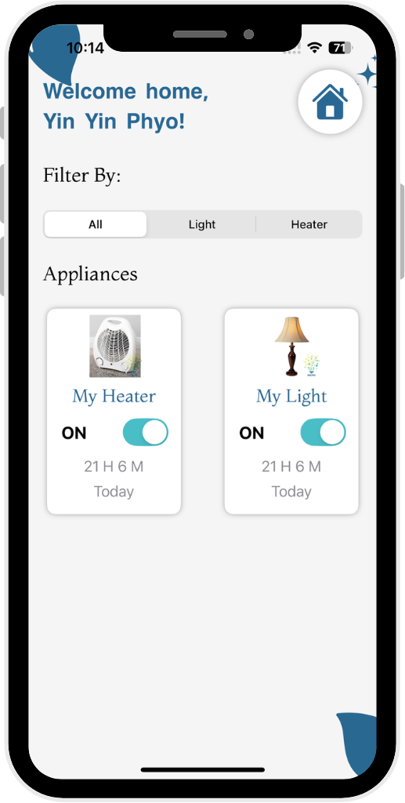
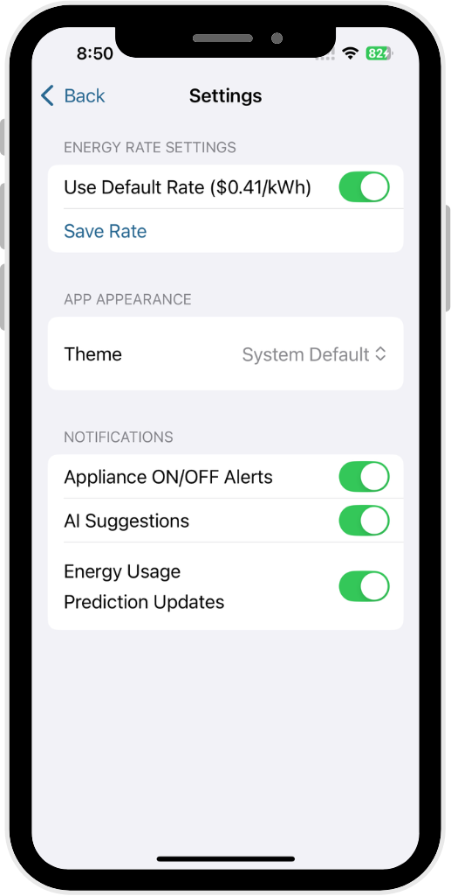

# Smart Home Energy Management System (SHEMS)

An AI-powered smart home platform built as a capstone project at San Francisco Bay University. SHEMS helps users reduce electricity usage and costs by automating appliance control based on sensor input and AI predictions.

## Features

- **User Authentication:** Secure login via Firebase (email/password)
- **Device Control:** Remotely toggle appliances with real-time Firestore sync
- **Automation Logic:** 
  - Light ON if motion detected; OFF after 1 hour
  - Heater ON below 25°C; OFF at or above 25°C
- **Energy Monitoring:** Interactive daily/hourly/monthly graphs + billing estimates
- **AI Forecasting:** 
  - Daily/hourly usage predictions using Prophet
  - Personalized cost forecasts based on usage history
- **AI Tips (GPT-4o):** Daily energy-saving suggestions
- **Settings:** Custom electricity rate, dark/light theme, and notifications

## Screenshots

| Login | Device Control | Usage Graphs | AI Suggestions | Settings |
|-------|----------------|--------------|----------------|----------|
|  |  |  |  |  |

## Tech Stack

- **Frontend:** SwiftUI, Swift, Firebase Auth, Firestore
- **Backend:** Raspberry Pi, Python, Google Cloud Run, Docker
- **AI/ML:** Prophet (energy forecasting), OpenAI GPT-4o-mini (energy tips)
- **Cloud Services:** Firebase, Google Cloud Scheduler, Secret Manager

## System Overview

- Sensors: PIR motion + DHT11 temperature
- Microcontroller: Raspberry Pi (Python)
- Cloud Database: Firestore (real-time sync)
- Mobile App: iOS with real-time UI updates
- AI Layer: Forecast + Suggestion APIs deployed as microservices

## Contributors

- Yin Yin Phyo – iOS App Development
- Zhiyu Zhang – AI/ML & Deployment
- Nang Thiri Wutyi – IoT & Sensor Integration

## Demo

- [Watch the App Demo Video](#https://drive.google.com/file/d/1K_xsqd8Jy_qm3LsQVpbdLAvFwqQjHFa7/view?usp=sharing)
- [Watch the Manual Control Demo Video](#https://drive.google.com/file/d/1-WqGfIsugvhem1wIa1_q6tAOGaLLVOpU/view?usp=sharing)

- [Final Presentation PDF](#https://drive.google.com/file/d/1HbBLbjniJwaN9-qYI3LXpxDdD3W5Wwex/view?usp=sharing)
- [Project Report PDF](#https://drive.google.com/file/d/1IlSaHKCCGwuk0gvSE8nBpPDHJP8Sconk/view?usp=drive_link)

---

*For questions, collaboration, or feedback, feel free to connect with me on [LinkedIn](https://www.linkedin.com/in/yinyinphyo29).*
